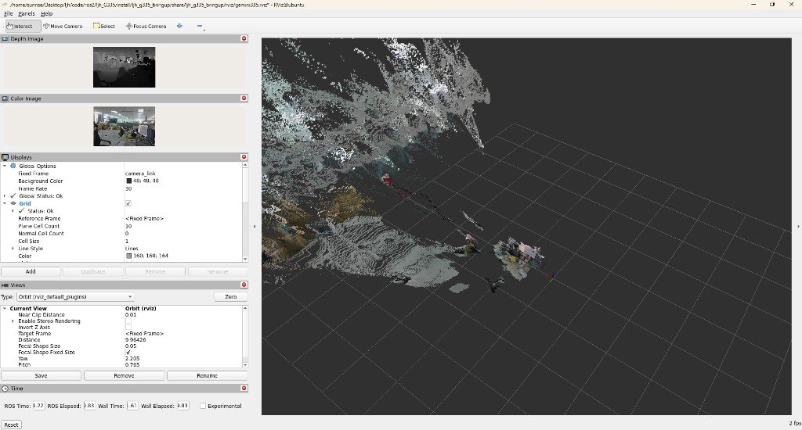

<!--
  作者：算个文科生吧
  联系方式：lijinghailjh@163.com
  作用：ljh_G335 项目说明文档（快速开始、Topic、排错、与官方驱动差异）
-->

# ljh_G335

Orbbec **Gemini 335** 在 **ROS 2 Humble** 上的开箱即用工作空间，面向 **aarch64 边缘板卡**（如 Sunrise）和 **USB 2.1** 环境做了实测调优。

**作者**：算个文科生吧 · **邮箱**：lijinghailjh@163.com

## 效果预览

一条命令启动后，RViz 同时显示 **RGB 图、深度图、彩色点云**：



*实测环境：Gemini 335 · USB 2.1 · 640×480@15 · 软件 D2C 对齐 · 彩色点云 topic：`/camera/depth_registered/points`*

---

## 这个项目有什么

| 模块 | 作用 |
|------|------|
| **`ljh_g335_bringup`** | 推荐入口：一键 launch、三档 profile、RViz 配置、Gemini 335 专用 YAML |
| **`OrbbecSDK_ROS2/`** | 官方 Orbbec ROS2 驱动（v2），含少量针对本场景的 launch / 配置补丁 |
| **`scripts/build.sh`** | 工作空间编译（板卡内存紧张时可 `PARALLEL_WORKERS=1`） |
| **`scripts/setup_env.sh`** | 一键 `source` Humble + 本工作空间，并检查是否已编译 |
| **`docs/images/`** | 文档配图（如上方点云演示） |

启动后主要话题：

- `/camera/color/image_raw` — 彩色图
- `/camera/depth/image_raw` — 深度图
- `/camera/depth_registered/points` — **彩色点云**（对齐到彩色坐标系，带 RGB）
- `/camera/depth/points` — 仅几何深度点云（无颜色）

---

## 和「直接用官方驱动」不一样在哪

1. **一条命令出图**  
   官方仓库需自己拼 launch、RViz、参数；这里默认：
   ```bash
   ros2 launch ljh_g335_bringup gemini335.launch.py serial_number:=<序列号>
   ```
   自动拉起相机 + 预置 RViz（彩色 / 深度 / **彩色点云** 已配好 topic 与 RGB8）。

2. **为 USB 2.1 + 边缘板卡踩过坑**  
   - 默认 **`align_mode:=SW`**（软件 D2C），避免 `hardware d2c process status:100`  
   - 默认 **`depth_registration:=true`** + **`enable_colored_point_cloud:=true`**  
   - 图像传输固定 **raw**，减少板卡上 compressed 插件的 CPU 开销  
   - 提供 **`balanced` / `performance` / `quality`** 三档 profile，按算力切换

3. **彩色点云 topic 写进 RViz**  
   驱动把彩色点云发在 **`/camera/depth_registered/points`**，不是 `/camera/depth/points`。本仓库 RViz 已指向正确 topic，避免「点云全白、看不出颜色」。

4. **YAML 配置可覆盖、launch 可透传**  
   在官方 `gemini_330_series.launch.py` 上增强：支持 bringup 包内 `config/gemini335.yaml`、命令行 `:=` 覆盖、延迟启动 RViz（`rviz_delay`）。

5. **环境脚本更省心**  
   `setup_env.sh` 会检测 `install/setup.bash` 是否存在，并清理旧包名 `ljh_gemini335_bringup` 的残留 `AMENT_PREFIX_PATH`。

---

## 快速开始

```bash
cd ~/Desktop/ljh/code/ros2/ljh_G335
chmod +x scripts/*.sh
PARALLEL_WORKERS=1 ./scripts/build.sh    # 板卡内存小建议 PARALLEL_WORKERS=1
source scripts/setup_env.sh

ros2 launch ljh_g335_bringup gemini335.launch.py serial_number:=<你的序列号>
```

| profile | 说明 |
|---------|------|
| `balanced`（默认） | 640×480@15，彩色点云 + 深度滤波，推荐日常 |
| `performance` | 更低 CPU，关闭点云 |
| `quality` | 更高分辨率（算力足够时用） |

可选参数示例：

```bash
# 指定 USB 口、关闭 RViz、半密度点云（更流畅）
ros2 launch ljh_g335_bringup gemini335.launch.py \
  serial_number:=CP0BB530002F usb_port:=3-1 rviz:=false \
  point_cloud_decimation_filter_factor:=2
```

---

## 排错

| 问题 | 处理 |
|------|------|
| `Package 'ljh_g335_bringup' not found` | 先 `source scripts/setup_env.sh` 或重新 `colcon build` |
| `hardware d2c status:100` | 保持 `align_mode:=SW`（launch 已默认），勿强行 `HW` |
| RViz 无图 | `ros2 topic hz /camera/color/image_raw` |
| 点云全白、无颜色 | RViz 订阅 `/camera/depth_registered/points`，Color Transformer 选 **RGB8** |
| 点云块状、看不清 | 减小 RViz 点大小；保持 `point_cloud_decimation_filter_factor:=1` |
| `TemporalFilter diff_scale out of range` | 时域滤波阈值须在 0.1–1，配置里用 `-1` 走设备默认 |
| `ljh_gemini335_bringup` 路径警告 | 新开终端再 `source scripts/setup_env.sh` |

---

## 目录结构

```
ljh_G335/
├── ljh_g335_bringup/     # launch、config、rviz（推荐入口）
├── OrbbecSDK_ROS2/       # orbbec_camera 等官方包 + 补丁
├── scripts/              # build.sh、setup_env.sh
├── docs/images/          # README 配图
└── README.md
```

## 上游与许可

- 本仓库内 `OrbbecSDK_ROS2/` 基于 [OrbbecSDK_ROS2](https://github.com/orbbec/OrbbecSDK_ROS2)（Apache-2.0），并含少量 launch / 配置补丁。
- `ljh_g335_bringup` 及 `scripts/` 为本项目新增，同样以 Apache-2.0 开源。
- 许可证全文见 `OrbbecSDK_ROS2/LICENSE`。
